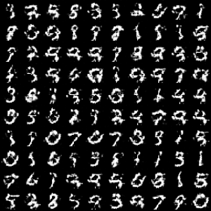

# DCGAN
MNISTをDCGANで生成するプログラム

## 使い方
* 学習

```python ctreate_dataset.py```

mnistをpickleに保存して使用しています.

```python train.py```

Trainerを使わない記述方法です.

* 画像生成

```python test.py```

学習済みモデルから画像を1枚生成します.

## 仕様
* python==3.6.1
* chainer==3.5.0
* cupy==2.5.0
* cuda==v8.0
* cuDNN==v6
* GPU: GeForce GTX 1080

## サンプル


## 参考
下記のサイトを参考に致しました.

<https://github.com/rystylee/chainer-dcgan-mnist>
